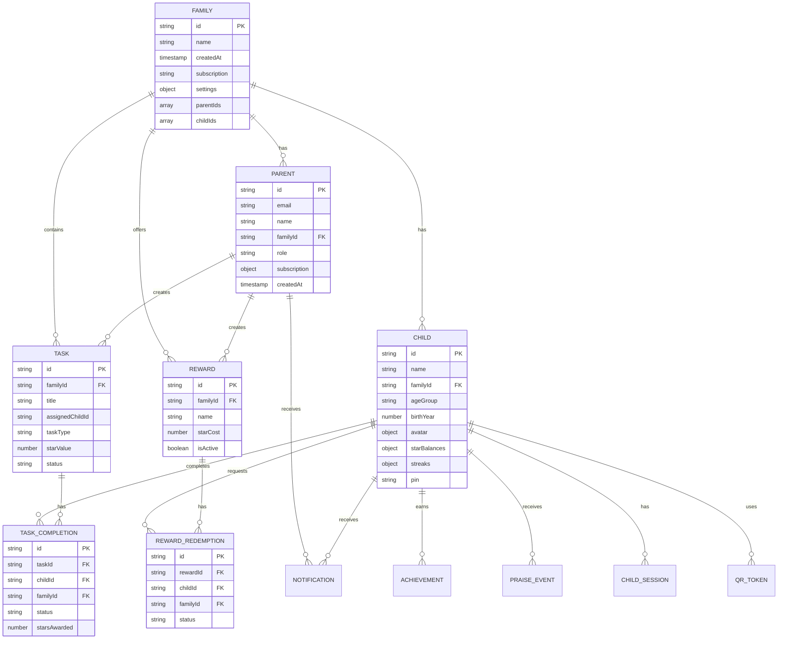

# Family Reward System - Database Structure

> **Complete Database Documentation for Reference and Future Development**

This document provides a comprehensive overview of all Firestore collections, their fields, relationships, and usage patterns.

---

## Table of Contents

- [Overview](#overview)
- [Entity Relationship Diagram](#entity-relationship-diagram)
- [Collections](#collections)
  - [1. families](#1-families)
  - [2. parents](#2-parents)
  - [3. children](#3-children)
  - [4. childSessions](#4-childsessions)
  - [5. qrTokens](#5-qrtokens)
  - [6. tasks](#6-tasks)
  - [7. taskCompletions](#7-taskcompletions)
  - [8. rewards](#8-rewards)
  - [9. rewardRedemptions](#9-rewardredemptions)
  - [10. achievements](#10-achievements)
  - [11. praiseEvents](#11-praiseevents)
  - [12. notifications](#12-notifications)
- [Type Definitions](#type-definitions)
- [Security Rules Summary](#security-rules-summary)
- [Common Query Patterns](#common-query-patterns)
- [Modification Guidelines](#modification-guidelines)

---

## Overview

The Family Reward System uses **Firebase Firestore** as its NoSQL database. The architecture follows a family-centric model where:

- **Parents** manage **Families**
- **Children** belong to **Families**
- **Tasks** and **Rewards** are scoped to **Families**
- All user activities (completions, redemptions) are tracked

### Collection Count: 12

| Collection | Purpose |
|------------|---------|
| `families` | Family groups and settings |
| `parents` | Parent user accounts |
| `children` | Child profiles |
| `childSessions` | Active child login sessions |
| `qrTokens` | QR code login tokens |
| `tasks` | Task definitions |
| `taskCompletions` | Task completion records |
| `rewards` | Reward definitions |
| `rewardRedemptions` | Reward redemption requests |
| `achievements` | Achievement badges earned |
| `praiseEvents` | Praise/encouragement events |
| `notifications` | System notifications |

---

## Entity Relationship Diagram



---

## Collections

### 1. families

**Purpose**: Stores family group information and settings.

```typescript
interface Family {
  id: string;                        // Document ID (auto-generated)
  name: string;                      // Family display name
  createdAt: Timestamp;              // Creation timestamp
  subscription: 'free' | 'premium';  // Subscription tier
  subscriptionExpiresAt?: Timestamp; // Premium expiration date
  settings: FamilySettings;          // Nested settings object
  parentIds: string[];               // Array of parent UIDs
  childIds: string[];                // Array of child document IDs
}

interface FamilySettings {
  timezone: string;                  // IANA timezone (e.g., "America/New_York")
  weekStartDay: 0 | 1;               // 0 = Sunday, 1 = Monday
  notificationPreferences: {
    emailDigest: 'daily' | 'weekly' | 'none';
    pushApprovals: boolean;
    pushRedemptions: boolean;
    pushInactivity: boolean;
    inactivityThresholdDays: number;
  };
  screenTimeDefaults: {
    defaultDailyLimitMinutes: number;
    bonusAllowedDays: ('weekday' | 'weekend' | 'holiday')[];
    bonusWindowStart: string;        // "14:00"
    bonusWindowEnd: string;          // "20:00"
  };
  starSettings: {
    weeklyCap: number;
    streakBonusPercent: number;
    maxStreakBonus: number;
    enableExpiry: boolean;
    expiryDays?: number;
  };
}
```

**Access Rules**:
- Read/Write: Parents in `parentIds` array
- Create: Authenticated user must be in `parentIds`

---

### 2. parents

**Purpose**: Stores parent user account information and subscription details.

```typescript
interface Parent {
  id: string;                    // Document ID (same as Firebase Auth UID)
  email: string;                 // Email address
  name: string;                  // Display name
  familyId: string;              // Reference to family document
  role: 'parent' | 'admin';      // User role
  subscription: SubscriptionInfo; // Subscription details
  createdAt: Timestamp;          // Account creation time
  lastLogin?: Timestamp;         // Last login timestamp
}

interface SubscriptionInfo {
  plan: 'free' | 'premium';
  status: 'active' | 'cancelled' | 'expired';
  currentPeriodStart: Timestamp;
  currentPeriodEnd: Timestamp;
  cancelledAt?: Timestamp;
  stripeCustomerId?: string;
  stripeSubscriptionId?: string;
}
```

**Access Rules**:
- Read/Update: Only the parent themselves (`request.auth.uid == parentId`)
- Create: Only during registration

---

### 3. children

**Purpose**: Stores child profiles with their progress, settings, and authentication info.

```typescript
interface Child {
  id: string;                        // Document ID (auto-generated)
  name: string;                      // Child's display name
  familyId: string;                  // Reference to family document
  ageGroup: '4-6' | '7-10' | '11-14' | '15+';
  birthYear: number;                 // Year of birth
  avatar: AvatarConfig;              // Avatar settings
  themeColor: string;                // UI theme color
  starBalances: StarBalances;        // Current star balance
  screenTimeLimits: ChildScreenTime; // Screen time settings
  goals: Goal[];                     // Array of active goals
  pin?: string;                      // Hashed PIN (4-6 digits)
  loginMethod: 'pin' | 'avatar' | 'qr' | 'device-session';
  lastActive: Timestamp;             // Last activity timestamp
  createdAt: Timestamp;              // Profile creation time
  streaks: StreakData;               // Streak information
}

interface StarBalances {
  growth: number;           // Current star count
  weeklyEarned?: number;    // Stars earned this week
  weeklyLimit?: number;     // Weekly earning cap
  lastWeekReset?: Timestamp; // Last weekly reset timestamp
}

interface StreakData {
  currentStreak: number;              // Current consecutive days
  longestStreak: number;              // Best streak ever
  lastCompletionDate: Timestamp | null;
  streakStartDate: Timestamp | null;
}

interface AvatarConfig {
  type: 'preset' | 'custom';
  presetId?: string;
  customUrl?: string;
  backgroundColor: string;
  accessoryIds?: string[];
}

interface ChildScreenTime {
  dailyLimitMinutes: number;
  bonusMinutesAvailable: number;
  usedTodayMinutes: number;
  bonusUsedTodayMinutes: number;
  lastReset: Timestamp;
}
```

**Access Rules**:
- Read/Write: Parents of the family
- Create: Parents in the family
- Limited Update: Child sessions can update `lastActive`, `starBalances`, `streaks`, `trustLevel`, `trustHistory`

---

### 4. childSessions

**Purpose**: Tracks active child login sessions for authentication without Firebase Auth.

```typescript
interface ChildSession {
  id: string;           // Document ID (session token)
  childId: string;      // Reference to child document
  familyId: string;     // Reference to family document
  deviceId: string;     // Unique device identifier
  loginMethod: 'pin' | 'avatar' | 'qr' | 'device-session';
  createdAt: Timestamp; // Session start time
  expiresAt: Timestamp; // Session expiration time
  lastActive: Timestamp; // Last activity timestamp
  isActive: boolean;    // Whether session is still valid
}
```

**Access Rules**:
- Read: Parents of the child
- Create/Update: Open (validated server-side)

---

### 5. qrTokens

**Purpose**: Stores QR code login tokens for child authentication.

```typescript
interface QRLoginToken {
  token: string;        // Document ID (the actual token)
  childId: string;      // Reference to child document
  familyId: string;     // Reference to family document
  createdAt: Timestamp; // Token creation time
  expiresAt: Timestamp; // Token expiration time (short-lived)
  used: boolean;        // Whether token has been consumed
}
```

**Access Rules**:
- Read: Anyone (needed for validation)
- Create: Parents of the child
- Update: Only `used` field can be updated

---

### 6. tasks

**Purpose**: Stores task definitions created by parents.

```typescript
interface Task {
  id: string;                     // Document ID (auto-generated)
  familyId: string;               // Reference to family document
  title: string;                  // Task title
  description?: string;           // Optional description
  assignedChildId: string | 'all'; // Specific child or all children
  taskType: 'one-time' | 'recurring' | 'habit' | 'challenge' | 'bonus';
  category: 'study' | 'health' | 'behavior' | 'chores' | 'creativity' | 'social';
  starValue: number;              // Stars awarded on completion
  starType: 'growth';             // Type of stars (for future expansion)
  proofRequired: 'none' | 'photo' | 'timer' | 'checklist' | 'parent-confirm';
  difficulty?: 'easy' | 'medium' | 'hard';
  approvalRule: ApprovalRule;     // Approval settings
  isAutoApproved: boolean;        // Auto-approval override
  isChatEnabled: boolean;         // Enable task chat
  frequency?: RecurrenceRule;     // Recurrence settings
  deadline?: Timestamp;           // Optional deadline
  status: 'active' | 'paused' | 'completed' | 'archived';
  icon?: string;                  // Optional icon identifier
  imageBase64?: string;           // Uploaded task image
  createdBy: string;              // Parent ID who created
  createdAt: Timestamp;           // Creation timestamp
  updatedAt: Timestamp;           // Last update timestamp
}

interface ApprovalRule {
  randomCheckPercent: number; // 0-100 (percentage for random checks)
  alwaysManual: boolean;      // Force manual approval
}

interface RecurrenceRule {
  type: 'daily' | 'weekly' | 'monthly' | 'custom';
  daysOfWeek?: number[];  // 0-6 (Sunday = 0)
  daysOfMonth?: number[]; // 1-31
  interval?: number;      // For custom intervals
  endDate?: Timestamp;    // Recurrence end date
}
```

**Access Rules**:
- Read/Write: Parents of the family
- Read: Open (children need access)

---

### 7. taskCompletions

**Purpose**: Records individual task completion attempts and approvals.

```typescript
interface TaskCompletion {
  id: string;              // Document ID (auto-generated)
  taskId: string;          // Reference to task document
  childId: string;         // Reference to child document
  familyId: string;        // Reference to family document
  completedAt: Timestamp;  // When child marked complete
  proof?: ProofData;       // Proof of completion
  status: 'pending' | 'approved' | 'rejected' | 'auto-approved';
  approvedBy?: string;     // Parent ID who approved
  approvedAt?: Timestamp;  // Approval timestamp
  rejectionReason?: string;
  starsAwarded: number;    // Stars given (after bonuses)
  trustDelta: number;      // Trust level change
  streakCount: number;     // Streak at time of completion
  bonusApplied: number;    // Bonus percentage applied
}

interface ProofData {
  type: 'none' | 'photo' | 'timer' | 'checklist' | 'parent-confirm';
  photoUrl?: string;
  timerDuration?: number; // Duration in seconds
  checklistItems?: ChecklistItem[];
  submittedAt: Timestamp;
}

interface ChecklistItem {
  id: string;
  text: string;
  completed: boolean;
}
```

**Access Rules**:
- Read/Update: Parents of the family
- Create: Open (children can submit completions)

---

### 8. rewards

**Purpose**: Stores reward definitions created by parents.

```typescript
interface Reward {
  id: string;                          // Document ID (auto-generated)
  familyId: string;                    // Reference to family document
  name: string;                        // Reward name
  description?: string;                // Optional description
  category: 'experience' | 'privilege' | 'choice' | 'material' | 'screen-time';
  starCost: number;                    // Cost in stars
  icon: string;                        // Icon identifier
  imageUrl?: string;                   // External image URL
  imageBase64?: string;                // Uploaded reward image
  availableToChildren: string[] | 'all';
  limitPerWeek?: number;               // Weekly redemption limit
  isActive: boolean;                   // Whether reward is available
  createdBy: string;                   // Parent ID who created
  createdAt: Timestamp;                // Creation timestamp
}
```

**Access Rules**:
- Read/Write: Parents of the family
- Read: Open (children need access)

---

### 9. rewardRedemptions

**Purpose**: Tracks reward redemption requests and their status.

```typescript
interface RewardRedemption {
  id: string;               // Document ID (auto-generated)
  rewardId: string;         // Reference to reward document
  rewardName: string;       // Denormalized reward name
  childId: string;          // Reference to child document
  familyId: string;         // Reference to family document
  requestedAt: Timestamp;   // When child requested
  status: 'pending' | 'approved' | 'rejected' | 'fulfilled';
  starsDeducted: number;    // Stars deducted from balance
  starType: 'growth';       // Type of stars used
  parentApprovedBy?: string; // Parent ID who approved
  parentApprovedAt?: Timestamp;
  fulfilledAt?: Timestamp;  // When reward was given
  notes?: string;           // Parent notes
}
```

**Access Rules**:
- Read/Update: Parents of the family
- Create/Read: Open (children can request)

---

### 10. achievements

**Purpose**: Stores achievement badges earned by children.

```typescript
interface Achievement {
  id: string;                  // Document ID (auto-generated)
  childId: string;             // Reference to child document
  type: AchievementType;       // Type of achievement
  unlockedAt: Timestamp;       // When achieved
  metadata?: Record<string, unknown>; // Additional data
}

type AchievementType =
  | 'first_task'      // First task completed
  | 'streak_7'        // 7-day streak
  | 'streak_30'       // 30-day streak
  | 'streak_100'      // 100-day streak
  | 'stars_100'       // 100 stars earned
  | 'stars_500'       // 500 stars earned
  | 'stars_1000'      // 1000 stars earned
  | 'first_reward'    // First reward redeemed
  | 'category_master' // Completed all in a category
  | 'trust_level_5'   // Reached trust level 5
  | 'goal_complete';  // Completed a goal
```

**Access Rules**:
- Read: Parents of the child, or anyone (children)
- Create: Open (system creates achievements)

---

### 11. praiseEvents

**Purpose**: Stores praise and encouragement events from parents to children.

```typescript
interface PraiseEvent {
  id: string;               // Document ID (auto-generated)
  childId: string;          // Reference to child document
  type: 'badge' | 'animation' | 'message' | 'voice-note' | 'reaction';
  content: PraiseContent;   // Praise content
  from: 'parent' | 'system';
  parentId?: string;        // Parent who sent (if from parent)
  createdAt: Timestamp;     // When created
  seen: boolean;            // Whether child has seen
}

interface PraiseContent {
  badgeId?: string;                     // For badge type
  animationType?: 'confetti' | 'stars' | 'fireworks' | 'rainbow';
  message?: string;                     // Text message
  voiceNoteUrl?: string;                // For voice-note type
  reactionEmoji?: string;               // For reaction type
}
```

**Access Rules**:
- Read/Create: Parents of the child
- Read/Update: Children can read and mark as `seen`

---

### 12. notifications

**Purpose**: Stores system notifications for parents and children.

```typescript
interface Notification {
  id: string;             // Document ID (auto-generated)
  userId: string;         // User ID (parent UID or child doc ID)
  userType: 'parent' | 'child';
  type: NotificationType; // Notification category
  title: string;          // Notification title
  body: string;           // Notification body
  data?: Record<string, unknown>; // Additional data
  read: boolean;          // Whether user has read
  createdAt: Timestamp;   // Creation timestamp
}

type NotificationType =
  | 'approval_needed'   // Task needs parent approval
  | 'task_approved'     // Task was approved
  | 'task_rejected'     // Task was rejected
  | 'reward_requested'  // Child requests reward
  | 'reward_approved'   // Reward request approved
  | 'streak_achieved'   // Streak milestone
  | 'goal_completed'    // Goal achieved
  | 'inactivity_alert'  // Child inactivity warning
  | 'weekly_summary';   // Weekly digest
```

**Access Rules**:
- Read: Only the user themselves
- Update: Only `read` field can be updated by user
- Create: Open (system creates notifications)

---

## Type Definitions

All TypeScript types are defined in `/src/types/index.ts`. Key enums and types:

### Enums

```typescript
// User Roles
type UserRole = 'parent' | 'admin';

// Authentication
type ChildLoginMethod = 'pin' | 'avatar' | 'qr' | 'device-session';

// Subscriptions
type SubscriptionPlan = 'free' | 'premium';
type SubscriptionTier = 'free' | 'premium';

// Age Groups
type AgeGroup = '4-6' | '7-10' | '11-14' | '15+';

// Stars
type StarType = 'growth';

// Tasks
type TaskType = 'one-time' | 'recurring' | 'habit' | 'challenge' | 'bonus';
type TaskCategory = 'study' | 'health' | 'behavior' | 'chores' | 'creativity' | 'social';
type ProofType = 'none' | 'photo' | 'timer' | 'checklist' | 'parent-confirm';
type TaskStatus = 'active' | 'paused' | 'completed' | 'archived';
type Difficulty = 'easy' | 'medium' | 'hard';

// Rewards
type RewardCategory = 'experience' | 'privilege' | 'choice' | 'material' | 'screen-time';
type RewardStatus = 'pending' | 'approved' | 'rejected' | 'fulfilled';

// Goals
type GoalType = 'weekly' | 'monthly' | 'custom';
type GoalStatus = 'active' | 'completed' | 'failed' | 'expired';

// Praise
type PraiseType = 'badge' | 'animation' | 'message' | 'voice-note' | 'reaction';
```

---

## Security Rules Summary

Security rules are defined in `/firestore.rules`. Key patterns:

| Collection | Parent Access | Child Access | Notes |
|------------|---------------|--------------|-------|
| `families` | Full CRUD | None | Only parents in `parentIds` |
| `parents` | Own profile only | None | UID must match |
| `children` | Full CRUD | Limited update | Children can update specific fields |
| `childSessions` | Read (own children) | Create/Update | Validated server-side |
| `qrTokens` | Create | Read | Anyone can read for validation |
| `tasks` | Full CRUD | Read only | Open read for children |
| `taskCompletions` | Read/Update | Create/Read | Children submit, parents approve |
| `rewards` | Full CRUD | Read only | Open read for children |
| `rewardRedemptions` | Read/Update | Create/Read | Children request, parents approve |
| `achievements` | Read | Read/Create | System creates |
| `praiseEvents` | Read/Create | Read/Update `seen` | |
| `notifications` | Own only | Own only | Only `read` field updatable |

---

## Common Query Patterns

### Get All Children in a Family
```typescript
const childrenQuery = query(
  collection(db, 'children'),
  where('familyId', '==', familyId)
);
```

### Get Pending Task Completions for a Family
```typescript
const pendingQuery = query(
  collection(db, 'taskCompletions'),
  where('familyId', '==', familyId),
  where('status', '==', 'pending'),
  orderBy('completedAt', 'desc')
);
```

### Get Active Tasks for a Child
```typescript
const tasksQuery = query(
  collection(db, 'tasks'),
  where('familyId', '==', familyId),
  where('assignedChildId', 'in', [childId, 'all']),
  where('status', '==', 'active')
);
```

### Get Child's Star Transactions (via TaskCompletions)
```typescript
const completionsQuery = query(
  collection(db, 'taskCompletions'),
  where('childId', '==', childId),
  where('status', '==', 'approved'),
  orderBy('completedAt', 'desc'),
  limit(50)
);
```

### Get Unread Notifications
```typescript
const notificationsQuery = query(
  collection(db, 'notifications'),
  where('userId', '==', userId),
  where('read', '==', false),
  orderBy('createdAt', 'desc')
);
```

---

## Modification Guidelines

### Adding a New Field to an Existing Collection

1. **Update Types**: Add the field to `/src/types/index.ts`
2. **Update Creation**: Modify the service function that creates documents
3. **Migration**: Decide if existing documents need the field (optional for Firestore)
4. **Security Rules**: Update `/firestore.rules` if the new field needs special access control

### Adding a New Collection

1. **Define Types**: Add interfaces to `/src/types/index.ts`
2. **Create Service**: Add CRUD functions to appropriate service file in `/src/lib/hooks/`
3. **Security Rules**: Add rules to `/firestore.rules`
4. **Document**: Update this file with the new collection details

### Changing Field Types

> [!CAUTION]
> Changing field types on existing data requires a migration strategy. Firestore is schema-less, so old documents will retain old types.

1. Create a migration script to update existing documents
2. Test thoroughly in a staging environment
3. Update all code references to expect both old and new types during transition

### Indexing Recommendations

For common queries, ensure composite indexes are created in Firebase Console:

| Collection | Fields | Type |
|------------|--------|------|
| `taskCompletions` | `familyId`, `status`, `completedAt` | Composite |
| `tasks` | `familyId`, `assignedChildId`, `status` | Composite |
| `notifications` | `userId`, `read`, `createdAt` | Composite |
| `rewardRedemptions` | `familyId`, `status`, `requestedAt` | Composite |

---

## Database Abstraction Layer

The project includes a database abstraction layer that enables switching between different NoSQL databases.

### Supported Adapters

| Adapter | Description | Real-time Support | Best For |
|---------|-------------|-------------------|----------|
| `firestore` | Firebase Firestore (default) | ✅ Native | Vercel, AWS, all platforms |
| `memory` | In-memory storage | ✅ Mock | Testing, development |
| `mongodb` | MongoDB Atlas | ⏳ Planned | Cross-platform |
| `dynamodb` | AWS DynamoDB | ⏳ Planned | AWS-native deployments |

### Usage

```typescript
// In React components, use the hook:
import { useDatabase } from '@/lib/db';

function MyComponent() {
  const db = useDatabase();
  
  // Query documents
  const children = await db.queryDocuments('children', {
    filters: [{ field: 'familyId', operator: '==', value: familyId }]
  });
  
  // Subscribe to real-time updates
  const unsubscribe = db.subscribe('tasks', { filters: [...] }, (tasks) => {
    setTasks(tasks);
  });
}
```

### Switching Databases

Set in `.env.local`:
```env
NEXT_PUBLIC_DATABASE_TYPE=firestore  # or: memory, mongodb, dynamodb
```

### Files

- [`/src/lib/db/interfaces.ts`](file:///Users/mahesh/work/Reward-system/src/lib/db/interfaces.ts) - Core interfaces
- [`/src/lib/db/firestore-adapter.ts`](file:///Users/mahesh/work/Reward-system/src/lib/db/firestore-adapter.ts) - Firestore implementation
- [`/src/lib/db/memory-adapter.ts`](file:///Users/mahesh/work/Reward-system/src/lib/db/memory-adapter.ts) - Memory adapter for testing
- [`/src/lib/db/provider.tsx`](file:///Users/mahesh/work/Reward-system/src/lib/db/provider.tsx) - React context provider
- [`/src/lib/repositories/base-repository.ts`](file:///Users/mahesh/work/Reward-system/src/lib/repositories/base-repository.ts) - Generic repository class

---

## File References

- **Type Definitions**: [`/src/types/index.ts`](file:///Users/mahesh/work/Reward-system/src/types/index.ts)
- **Security Rules**: [`/firestore.rules`](file:///Users/mahesh/work/Reward-system/firestore.rules)
- **Requirements**: [`/REQUIREMENTS.md`](file:///Users/mahesh/work/Reward-system/REQUIREMENTS.md)
- **Firebase Config**: [`/src/lib/firebase.ts`](file:///Users/mahesh/work/Reward-system/src/lib/firebase.ts)
- **Database Abstraction**: [`/src/lib/db/`](file:///Users/mahesh/work/Reward-system/src/lib/db/)

---

*Last Updated: December 16, 2025*
